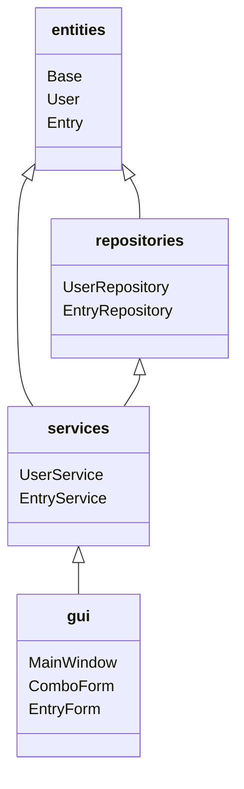
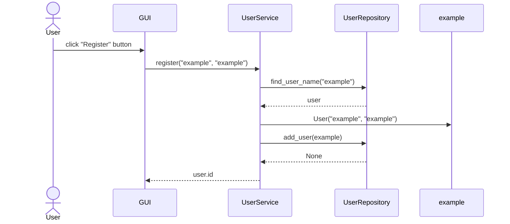
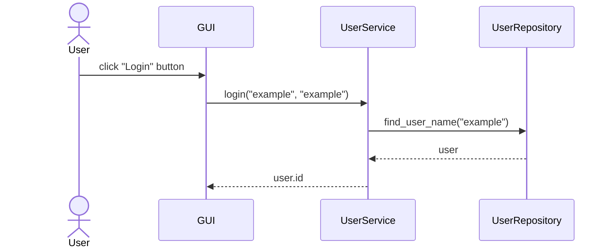
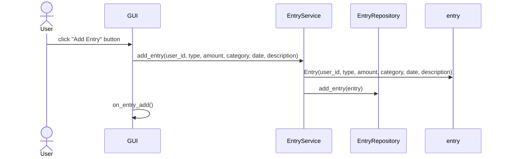
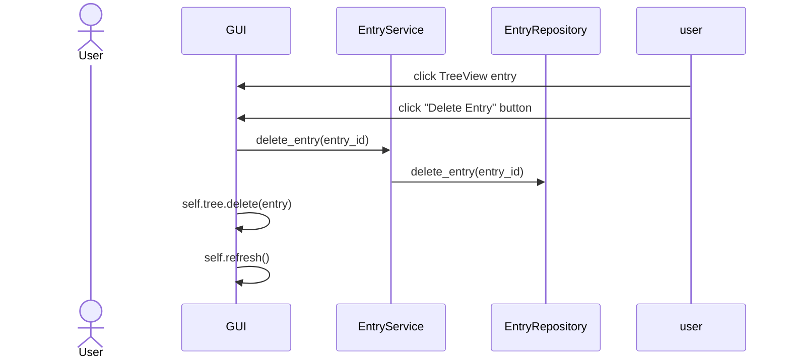

### Structure

This is roughly how the different areas of the code interact with eachother. Note that this is not a standard class
diagram!

### Main functionalities
#### User registration

By clicking Register, the user calls `register()` in `ComboForm`, which in turn calls the function by
the same name in `UserService`. Once the inputs are validated, `add_user()` in `UserRepository` is called.
This marks the process as having successfully completed, prompting the `ComboForm` to close, opening the main window.

#### User login

By clicking Login, the user calls `login()` in `ComboForm`, which in turn calls the function by
the same name in `UserService`. If `user_repository.find_user_name(username)` finds the user, the password is checked.
Upon successfully finding the user and checking the password, `ComboForm` is closed, and the main window is opened.

#### Entry creation

`EntryForm` validates the inputs given by the user, and calls `entry_service.add_entry()` on success. This function
creates the Entry instance, and calls `entry_repository.add_entry()` to add it to the database. If all these steps are
successful, `EntryForm` calls `on_entry_add()`, which updates the TreeView.

#### Entry deletion

The chosen entry from the TreeView is selected with `tree.selection()`, and is then deleted from the database by
calling `delete_entry()` first in `EntryService`, then `EntryRepository`. The entry is separately deleted from
the TreeView with `tree.delete(entry)`, and finally the TreeView is refreshed.