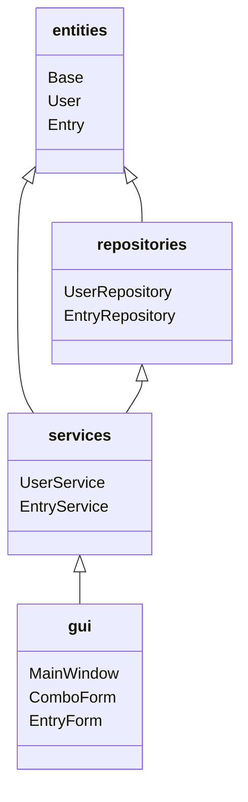

```mermaid
classDiagram
entities <|-- repositories
entities <|-- services
repositories <|-- services
services <|-- gui

entities: Base
entities: User
entities: Entry

repositories: UserRepository
repositories: EntryRepository

services: UserService
services: EntryService

gui: MainWindow
gui: ComboForm
gui: EntryForm
```

This is roughly how the different areas of the code interact with eachother. Note that this is not a standard class diagram!