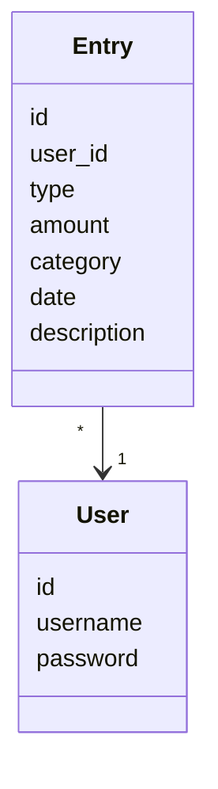
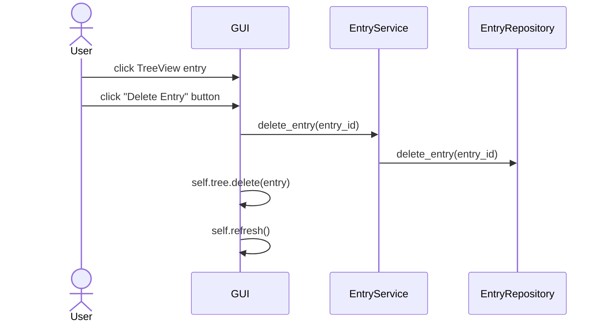

# Architecture
## Structure

This is roughly how the different areas of the code interact with each other. Note that this is not a standard class
diagram!

## User interface
The user interface consists of the following views:
- Login/Register form
- Entry list
- Entry addition form
- Graph of net finances

The [Login/Register form](../src/gui/combo_form.py) and the [entry addition form](../src/gui/entry_form.py) are defined
in separate files and classes. The entry list and graph are defined in the [same file and class](../src/gui/main_window.py),
but separated into their own sections with comments within the file.

## Program logic
The program functionality is based on two entity classes, [User](../src/entities/user.py) and [Entry](../src/entities/entry.py).

These two entity classes are technically only used to create database tables and fields with the same names, and all logic
related to these classes are defined in the repository and service classes. All function calls from the GUI are called through
[UserService](../src/services/user_service.py) and [EntryService](../src/services/entry_service.py).

## Main functionalities
### User registration

By clicking Register, the user calls `register()` in `ComboForm`, which in turn calls the function by
the same name in `UserService`. Once the inputs are validated, `add_user()` in `UserRepository` is called.
This marks the process as having successfully completed, prompting the `ComboForm` to close, opening the main window.

### User login

By clicking Login, the user calls `login()` in `ComboForm`, which in turn calls the function by
the same name in `UserService`. If `user_repository.find_user_name(username)` finds the user, the password is checked.
Upon successfully finding the user and checking the password, `ComboForm` is closed, and the main window is opened.

### Entry creation

`EntryForm` validates the inputs given by the user, and calls `entry_service.add_entry()` on success. This function
creates the Entry instance, and calls `entry_repository.add_entry()` to add it to the database. If all these steps are
successful, `EntryForm` calls `on_entry_add()`, which updates the TreeView.

### Entry deletion

The chosen entry from the TreeView is selected with `tree.selection()`, and is then deleted from the database by
calling `delete_entry()` first in `EntryService`, then `EntryRepository`. The entry is separately deleted from
the TreeView with `tree.delete(entry)`, and finally the TreeView is refreshed.

## Deficiencies
The entry list view and the graph view could be separated into their own classes, and functions within [MainWindow](../src/gui/main_window.py)
could be turned into multiple smaller functions for increased clarity. Currently this class is responsible for too many things.