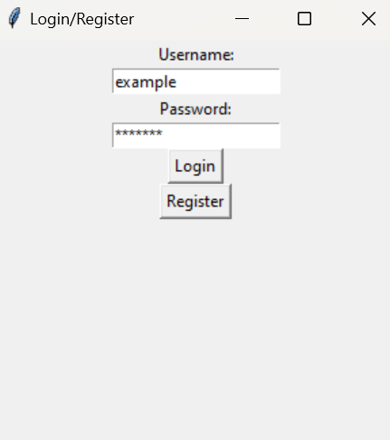

# Guide

Download the latest release by clicking one of the options [here](https://github.com/virhe/ot-harjoitustyo/releases)

## Config

The database name can be changed from "default" to something else by creating a .env file in the root folder with
the following content (replace [NAME] with a database name of your choice):

```
DATABASE_NAME=[NAME].db
```

## Starting the program

Install dependencies with:

```
poetry install
```

Now you can start the program with:

```
poetry run invoke start
```

## User login and registration

The user can login by providing a username and a password, and clicking the "Login" button.
Registration follows the same steps, except you press "Register" instead of "Login".



## Entry creation

Entires are added by clicking the "Add Entry" button at the bottom, and filling out information
on the screen that pops up.


## Entry deletion

Entries are deleted by clicking on the entry you want to delete, and clicking "Delete Entry" button at the bottom.


## Viewing entries on the graph

The net finance graph can be viewed by clicking on the "Graph" tab at the top, selecting a year and month
with the combo boxes at the bottom, and finally pressing "Update"

