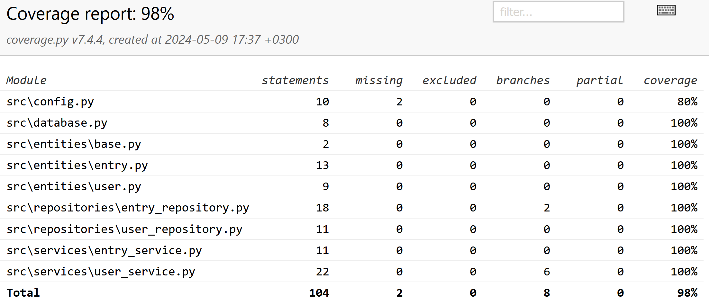

## Testing

The tests where made in a way where entities, repositories and services and grouped instead of making a separate file for each.
In practice the test structure looks like this:

- test_entitites.py: Entry, User
- test_repositories.py: EntryRepository, UserRepository
- test_services.py: EntryService, UserService
- test_config.py: config.py
- test_database.py: database.py

All tests share the same initial conditions through [conftest.py](../src/tests/conftest.py) to reduce repetition and increase clarity.

### Coverage

The final test coverage reached 98%

Everything GUI related is left outside of testing. The missing 2% are two lines in config.py, which I didn't have time to test.

## System testing

All testing from an end user perspective is done manually through various actions, such as using unintended inputs.
The program was tested with Windows, macOS and Linux. All the listed functionality has been tested, along
with some unintended actions as previously stated.

## Deficiencies

Although this may be subjective, it might have been better to perform tests on a real database file instead of using an in-memory database.