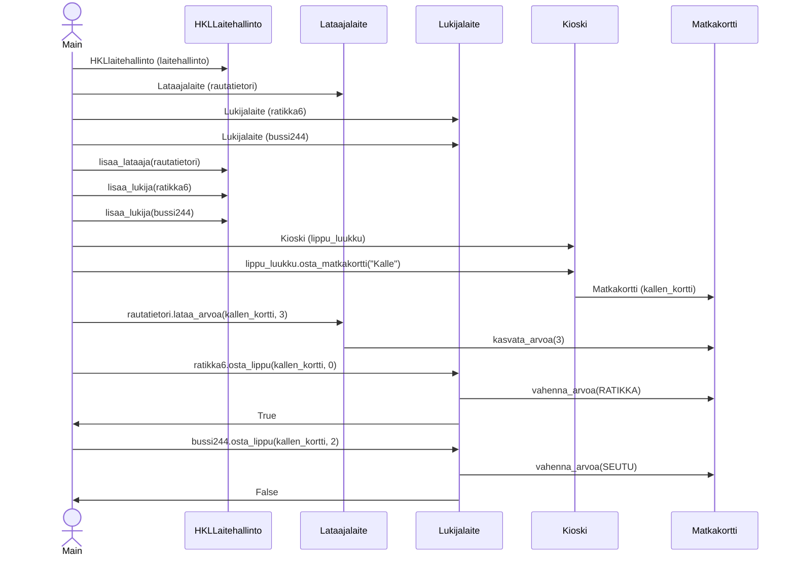

```mermaid
sequenceDiagram
    actor Main
    
    participant HKLLaitehallinto
    participant Lataajalaite
    participant Lukijalaite
    participant Kioski
    participant Matkakortti

    Main->>HKLLaitehallinto: HKLlaitehallinto (laitehallinto)
    
    Main->>Lataajalaite: Lataajalaite (rautatietori)
    Main->>Lukijalaite: Lukijalaite (ratikka6)
    Main->>Lukijalaite: Lukijalaite (bussi244)
    
    Main->>HKLLaitehallinto: lisaa_lataaja(rautatietori)
    Main->>HKLLaitehallinto: lisaa_lukija(ratikka6)
    Main->>HKLLaitehallinto: lisaa_lukija(bussi244)
    
    Main->>Kioski: Kioski (lippu_luukku)
    Main->>Kioski: lippu_luukku.osta_matkakortti("Kalle")
    Kioski->>Matkakortti: Matkakortti (kallen_kortti)
    
    Main->>Lataajalaite: rautatietori.lataa_arvoa(kallen_kortti, 3)
    Lataajalaite->>Matkakortti: kasvata_arvoa(3)
    
    Main->>Lukijalaite: ratikka6.osta_lippu(kallen_kortti, 0)
    Lukijalaite->>Matkakortti: vahenna_arvoa(RATIKKA)
    Lukijalaite->>Main: True
    
    Main->>Lukijalaite: bussi244.osta_lippu(kallen_kortti, 2)
    Lukijalaite->>Matkakortti: vahenna_arvoa(SEUTU)
    Lukijalaite->>Main: False
```